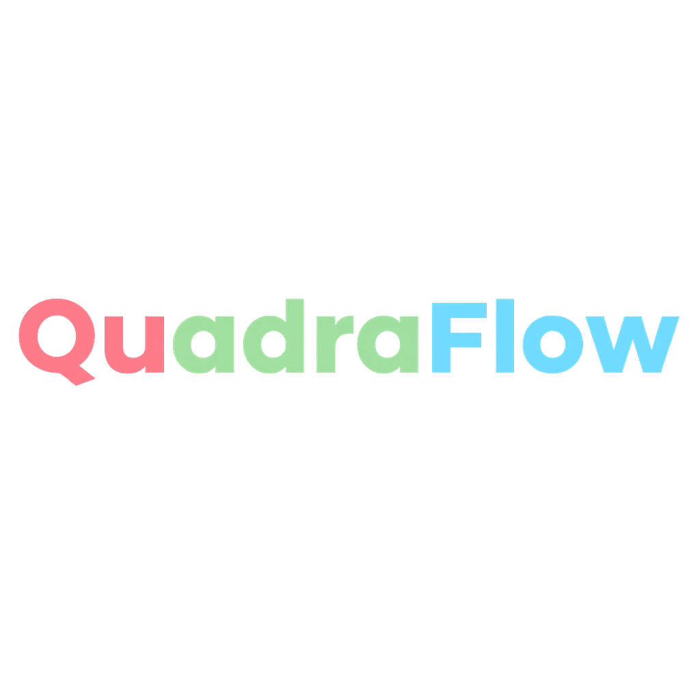
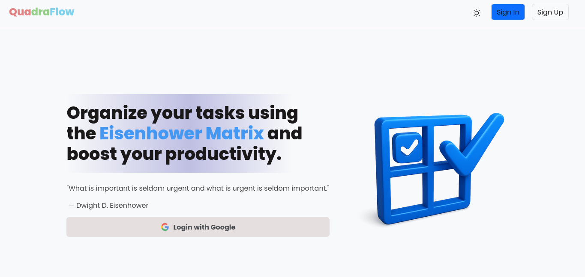
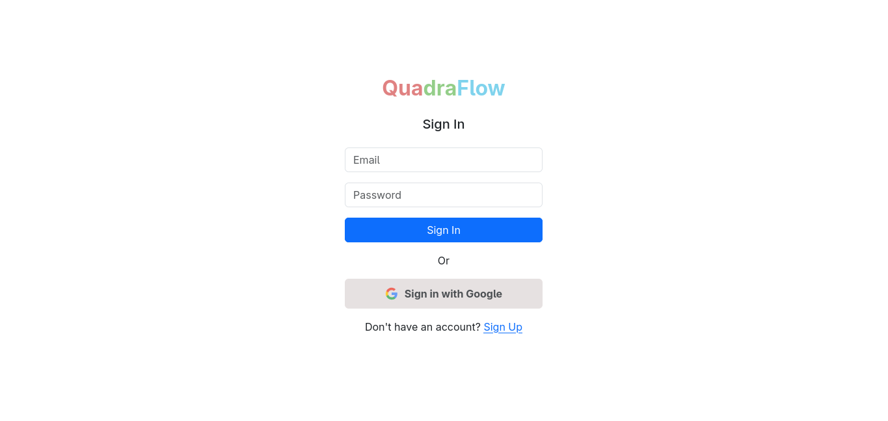
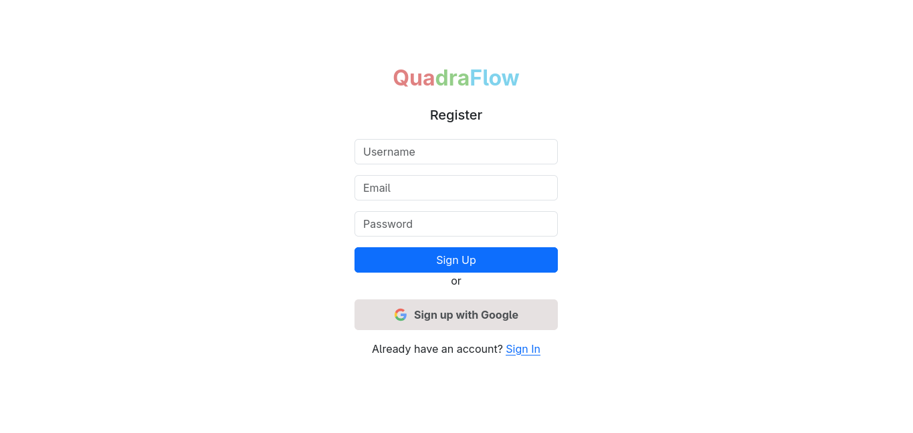
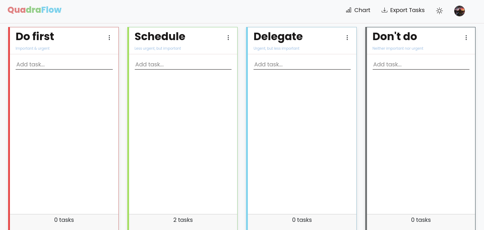
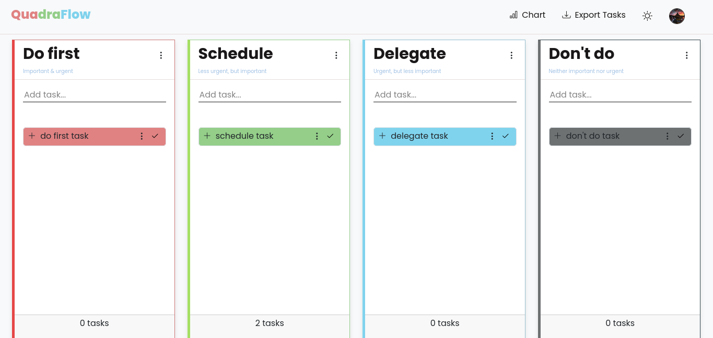
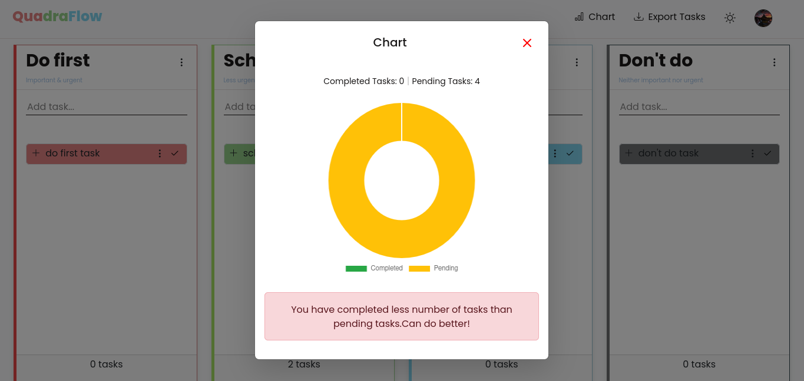
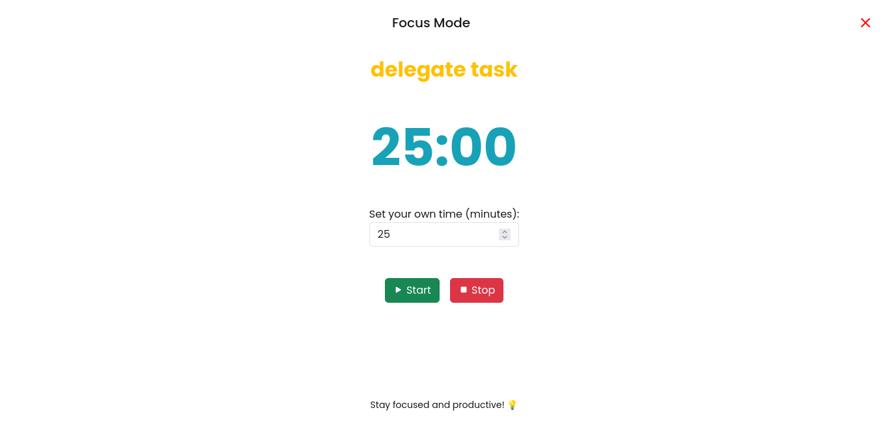
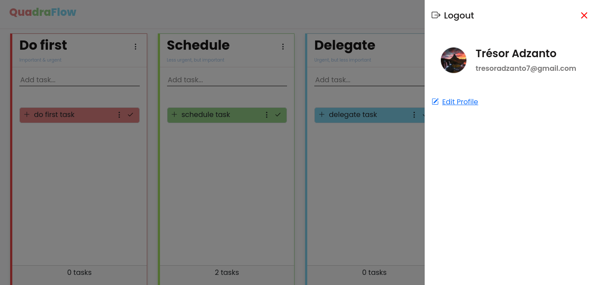

<div style="display: flex; align-items: center; justify-content: center;">
    
</div>

## Introduction

This is a task management web application based on the Eisenhower Matrix, designed to help users prioritize and organize their tasks and projects effectively.

As mentioned, the app uses the Eisenhower Matrix, which means users can categorize their tasks into four distinct quadrants:

1. ### Urgent and Important

2. ### Not Urgent but Important

3. ### Urgent but Not Important

4. ### Neither Urgent nor Important

This structure helps users focus on what truly matters, delegate less critical tasks, and eliminate distractions.

---

## Fonctionalities 

- Google Authentication 
- Task Management with the Eisenhower matrix
- Exportation CSV / PDF

## Technologies used

- Backend and Frontend are both handled by the Django Framework

## How to Run the Application

### Steps

1. **Set Up a Virtual Environment**:

    ```bash
    python -m venv venv
    source venv/bin/activate # On Windows: venv\Scripts\activate
    ```

2. **Install Dependencies**:

    ```bash
    pip install -r requirements.txt
    ```

3. **Run Migrations**:

    ```bash
    python manage.py makemigrations
    python manage.py migrate
    ```

4. **Start the Development Server**:

    ```bash
    python manage.py runserver
    ```

5. **Access the Application**:
    Open [http://127.0.0.1:8000](http://127.0.0.1:8000) in your browser.

---

## Additional Information

### Testing

To run the tests:
```bash
python manage.py test
```
## Screenshots

Here are some screeshots :

### Welcome Page


### Authentication



### Dashboard View



### Task Creation Modal


### Chart View 


### Focus Mode View 


### Profile Offcanvas


---
# Author

- Trésor Adzanto
- Email: click [here](tresoradzanto7@gmail.com)
- Web Site: click [here](https://tresor-del.github.io)